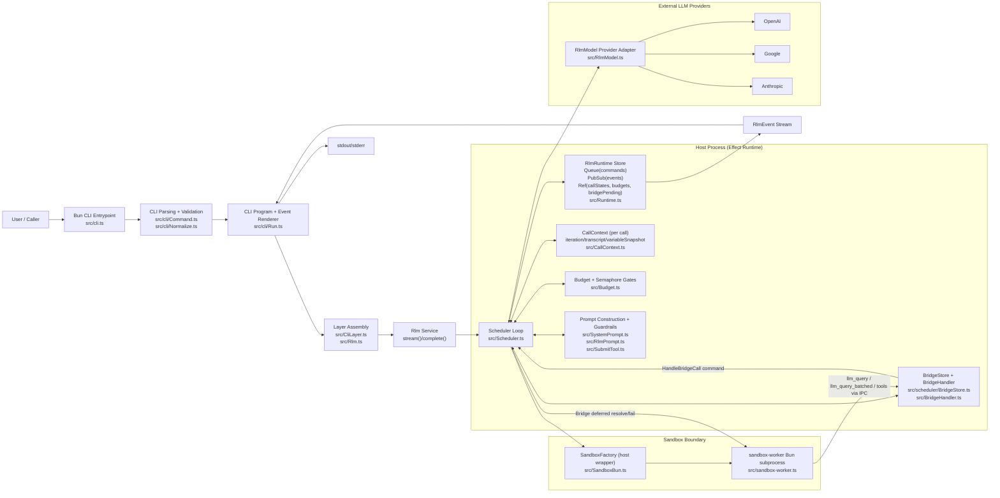
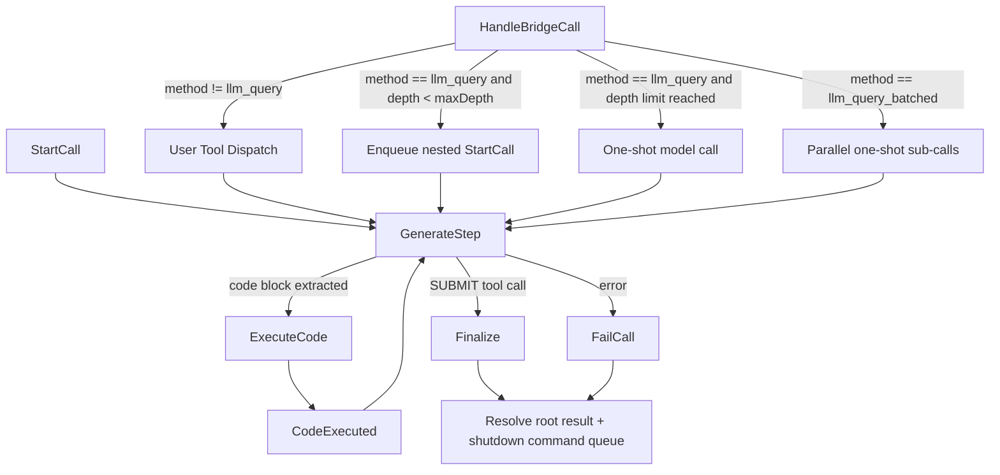
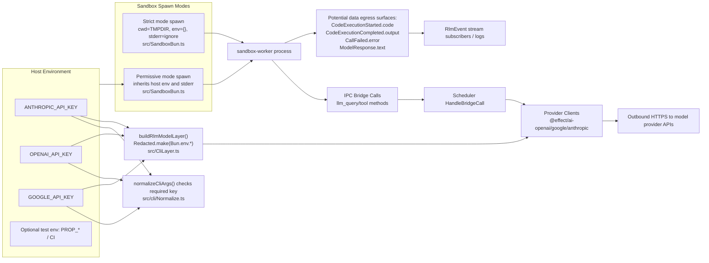

# Recursive LLM Architecture (Current State)

As of 2026-02-09, this repository is a Bun CLI-first, in-memory recursive orchestration runtime.

## 1) System Architecture

## 2) Scheduler Command State Machine

## 3) Secrets and Trust-Boundary Diagram

## 4) Fact Source Index

- CLI entrypoint and execution: `src/cli.ts`, `src/cli/Command.ts`, `src/cli/Run.ts`.
- Per-call dependency/layer assembly: `src/Rlm.ts`.
- Scheduler queue-driven orchestration and command dispatch: `src/Scheduler.ts`.
- Runtime in-memory state (Queue, PubSub, Ref, Semaphore): `src/Runtime.ts`.
- Per-call mutable context: `src/CallContext.ts`.
- Bridge deferred lifecycle: `src/scheduler/BridgeStore.ts`, `src/BridgeHandler.ts`.
- Sandbox process + strict/permissive spawn behavior: `src/SandboxBun.ts`, `src/sandbox-worker.ts`.
- Provider integration and API key consumption: `src/CliLayer.ts`, `src/RlmModel.ts`, `src/cli/Normalize.ts`.
- Prompt/guardrail/finalization path: `src/SystemPrompt.ts`, `src/RlmPrompt.ts`, `src/SubmitTool.ts`.
